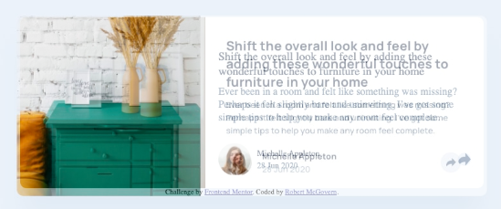

Started 30th Sept 2020 at 21:04

Set up basics. will need to look up how to do the for the share, however no internet right now (been down all day)
* how to show the share icon
* how to do a callout (desktop)
* how to do overlay (mobile)
* look up again how to do crop of image (image like 2/5, text 3/5 of space)

How have I forgotten how to push only some of the flex to the far right.
Seriously. margin-left: auto; 🤦‍♂️

So 2 hours later. Structure in place, I have a rough version for both desktop and mobile that are close to the right size (mobile will be closer when I crop the article image down.)

I can't chase sizing yet because I have no internet and can't get the font to use.

These are the differences at this point. Mobile with slider, and desktop with fade because it was easier to show that way.

