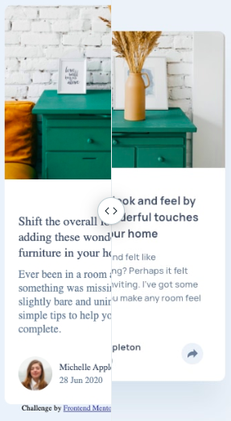
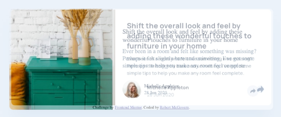

Started 30th Sept 2020 at 21:04

Set up basics. will need to look up how to do the for the share, however no internet right now (been down all day)
* how to show the share icon
* how to do a callout (desktop)
* how to do overlay (mobile)
* look up again how to do crop of image (image like 2/5, text 3/5 of space)

How have I forgotten how to push only some of the flex to the far right.
Seriously. margin-left: auto; 🤦‍♂️

So 2 hours later. Structure in place, I have a rough version for both desktop and mobile that are close to the right size (mobile will be closer when I crop the article image down.)

I can't chase sizing yet because I have no internet and can't get the font to use.

These are the differences at this point. Mobile with slider, and desktop with fade because it was easier to show that way.




Okay, as I've set things up I can't use something like the following to shrink the image. using absolute takes it out of the flow of the component

```css
position: absolute;
clip: rect(0px,60px,200px,0px);
```

Signed up to the Pro account and made the mistake of taking a look at the sketch file. I knew I couldn't resist getting some of the bits from it. *sigh*

Still trying to eyeball what I can but I find myself wanting to look (for line and letter spacing).

Did use it for the shadow, because I wasn't going to guess that color. Sheesh 🤯

Picking this up on the 3rd. The mobile version is nearly properly positioned. Its off by a bit (whole component is a little shorter), but everything else is close. (Except still not sorted the thing around the share icon) 

---

Can't figure out how to properly portion to get the desktop image a bit bigger. Playing with flex portions changes too much. Grid better? I want to say the pic is 40% of the size, and body is 60% of the size.

---

Picked up hours later.

Used this https://cssdeck.com/labs/bv45bh6p for the callout/tooltip

Don't understand why the img/svg inside the button shifts up when tooltip appears.

~~~Broke the desktop version while adding the share stuff. Not entirely sure how.~~~