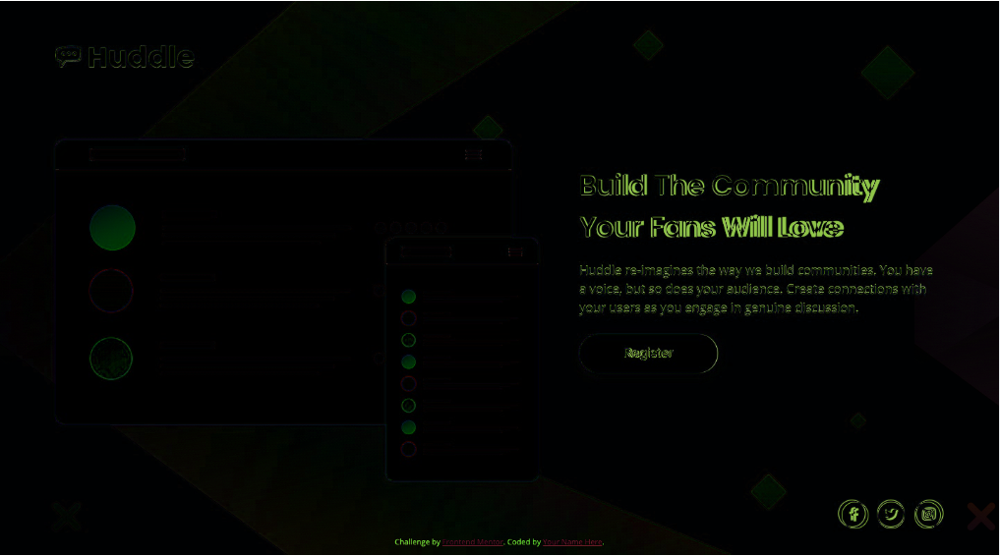

notes on how i approached this

downloaded
read readme
read style guide
created css file
added it to the html file
added font awesome to the html file
added fonts to the css file
added initial styling (fonts, background color, background image)
in html file I 
    added header
    added divs for sections (logo, middle, social media buttons)
    put divs around existing content (text for right side)
    added logo
    added mockup image
    added icons for social media
    saved it out
moved on to css
    adjust positioning based on how it looks on design
    got things roughly in position.
    pause for bed, however curious how I am in relation to design file
    realise I really can't match 1440x800 because the laptop I'm using is only 1366x768 (originally thought it was 2560x1440, page said only 1440 ... easy mistake. Had to look at design image for res)
go to sleep
next morning I realise
    chrome in developer mode allows you to create devices of specific resolutions
    set up 2, one 1440x800 and the other 375x800
    I can then save out the image and use diffchecker.com and use the design image vs the current image of the page to compare and see how close I am. You can use a diff mode that only shows the differences (mostly in green) which makes it easier to adjust.
    Now, now I need to finish styling for desktop ...
    remainder of day lost to calls and roleplaying
next day 
    download diffchecker trial rather than keep using website
    adjust size of logo svg
    play with positioning using margin and rem. Logo and mockup images are so close at this point (see image diff 1)
    
    realise I probably should be using % rather than rem for margin positioning
    also should probably be using 0 positioning in body and doing it in each element
    tweaked logo and mid section margins mixture rem & % for the moment
    set body to have 0 margin
    seemingly no changes are made with % unless they are to a pixel, so 4.86 is the same as 4.8611111, need to go to next px % which is 4.7916666667
    then lots and lots of iterating. Making changes and comparing in diffchecker against the design doc.
    Spent 2 hours+ on this. Too long.
    Still haven't quite nailed the blurb section.
        Basically the logo is slight off
        the differences between the mockup and symbols are image quality between jpg and png
        its like a pixel off with the social media buttons
    img-diff-2-desktop-near-enough.png
    
    Still now on to the mobile variant. Can I nail it better?
    spent an age on this, lots of tweaking. Not quite there but nearly, so nearly
    
    submit to frontend mentor as a solution

Couple of days later
    So I had a 3 responses on Frontend Mentor page
    1 Comment on Slack
    2 responses on Twitter. 
    less than I hoped but some useful information to take on board
        First: Don't worry about it being so exact(!!), being a little off/up/down/font off doesn't really matter ... ALTHOUGH it CAN pay off to be exact. Theoretically you are hired to implement the required design, so best to be as exact as possible.
        Second: Link color in the attribution is impossible to read. My fault for not making any changes to it.
        Third: mobile design - make icon size 13x13, that will fix centering
        Fourth: mobile design - the hit box for the link is off from the image/circle
        fifth: look at stacked icons on font awesome https://fontawesome.com/how-to-use/on-the-web/styling/stacking-icons
        sixth: hover state for social icons not a good color. Aim for a lighter violet. Aim to stay in color scheme (important for accessibility)
        seventh: good not used too much css, nor complex structure
        eighth: "personal pet peeve" html button is only valid in an html form, otherwise use a anchor styled as a button because a button has no href. -- Not sure which way to go with this because its not clear what would happen on the button press. Does it go to a new page, or reveal a email submission box
        ninth: "personally I would have wrapped the social icons and the footer links in a combined foot section just because that makes them easier to move later if doing a whole site". Mixed on this, attribution link at bottom was not part of the original design, but was part of the base files, and is something that was deletable. 
        tenth: (overall people though I did a good/awesome job)
        eleventh: was told to check out PerfectPixel extension for Chrome/Firefox. Similar job to diffchecker, can use to add a design image as a layer and you can see how off you are from the design ... being by opacity or there is a difference view
        twelfth: documenting the process was apparently helpful ("its something not everyone does, but should")
        thirteenth: Design probably means in wide formats that the page should cover all the screen. Both in height and width. That is more powerful than image should be at X/Y, should be this tall. Text should also be at X/Y and be a certain size, with certain spacing between letters/lines.
        fourteenth: Limit the width of the components, and contain them to the center of your screen.
        fifteenth: At present if you go really wide on the page, the text will appear in only one line. It totally loses its expected design. Use a main container to hold everything inside it. Limit its size and automatically center it.
        sixteenth: I've used flexbox but some of the child elements are not restricted in the size they can take. This si useful to maintain proportions at different sizes. (Good example is the mockup image, which takes up more space than it should in the sizes between roughly 500-800px)
        seventeenth: Basically ... try not to restrict your designs to two resolutions. Make it work for in-between widths.