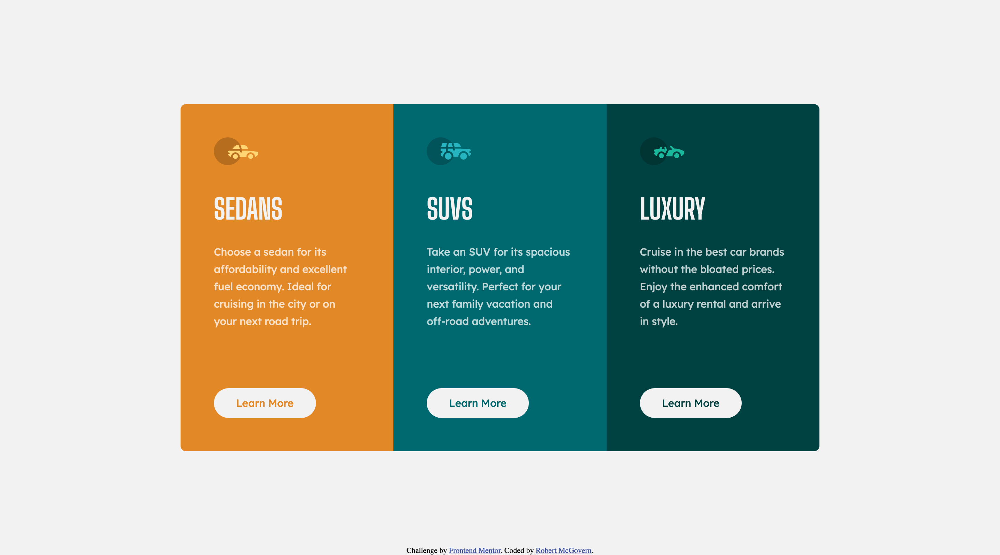
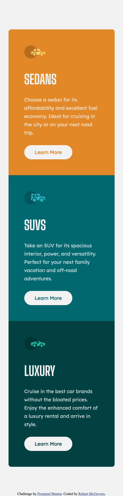

# Frontend Mentor - 3-column preview card component solution

This is a solution to the [3-column preview card component challenge on Frontend Mentor](https://www.frontendmentor.io/challenges/3column-preview-card-component-pH92eAR2-). Frontend Mentor challenges help you improve your coding skills by building realistic projects.

## Table of contents

- [Frontend Mentor - 3-column preview card component solution](#frontend-mentor---3-column-preview-card-component-solution)
  - [Table of contents](#table-of-contents)
  - [Overview](#overview)
    - [The challenge](#the-challenge)
    - [Screenshot](#screenshot)
    - [Links](#links)
  - [My process](#my-process)
    - [Built with](#built-with)
    - [What I learned](#what-i-learned)
    - [Continued development](#continued-development)
  - [Author](#author)
  - [Acknowledgments](#acknowledgments)

**Note: Delete this note and update the table of contents based on what sections you keep.**

## Overview

### The challenge

Users should be able to:

- View the optimal layout depending on their device's screen size
- See hover states for interactive elements

### Screenshot

Here are the final images for the desktop version

and for the mobile version

### Links

- Solution URL: [Gitea on rmcg.dev](https://git.tarasis.net/tarasis/rmcg.dev/src/branch/main/projects/FrontendMentor/newbie/3-column-preview-card-component)
- Live Site URL: [rmcg.dev](https://rmcg.dev/FrontendMentor/newbie/3-column-preview-card-component)

## My process

### Built with

- Semantic HTML5 markup
- CSS custom properties
- Flexbox
- Mobile-first workflow

### What I learned

I was rusty as I hadn't touched html/css/javascript in 7 months. Solution came together fairly quickly.

As usual I focused on mobile first, and then added some minor tweaks for desktop. (Specifically the "Learn More" button is lower on the desktop version)

I spent a little time chasing box widths, mainly it was paragraph width. Honestly I should have simply stayed with the `25ch` used for the mobile version rather than having `23.15ch` for the desktop.

### Continued development

Continue working through the `newbie` projects that I have, with an eye to trying to use `grid` rather than `flexbox`.

## Author

- Website - [Blog](https://tarasis.net)
- Website - [Portfolio](https://rmcg.dev)
- Frontend Mentor - [@tarasis](https://www.frontendmentor.io/profile/tarasis)
- Twitter - [@tarasis](https://www.twitter.com/tarasis)

## Acknowledgments

Just Matt front [Frontend Mentor](https://www.frontendmentor.io) for creating the site. These challenges have been an effective way of learning.