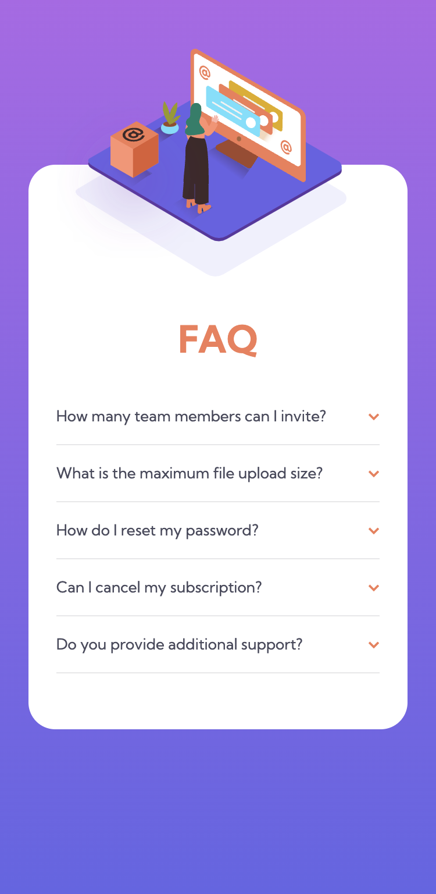
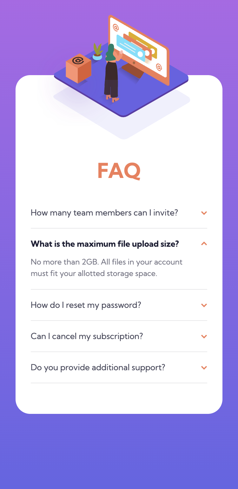
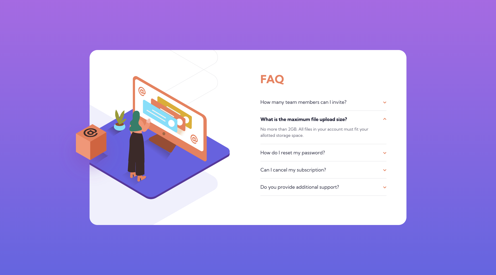

# Frontend Mentor - FAQ Accordion Card

This is a solution to the [FAQ Accordion Card](https://www.frontendmentor.io/challenges/faq-accordion-card-XlyjD0Oam). Frontend Mentor challenges help you improve your coding skills by building realistic projects.

## Table of contents

- [Frontend Mentor - FAQ Accordion Card](#frontend-mentor---faq-accordion-card)
  - [Table of contents](#table-of-contents)
  - [Overview](#overview)
    - [The challenge](#the-challenge)
    - [Screenshot](#screenshot)
    - [Links](#links)
  - [My process](#my-process)
    - [Built with](#built-with)
    - [What I learned](#what-i-learned)
    - [Continued development](#continued-development)
    - [Useful resources](#useful-resources)
  - [Author](#author)
  - [Acknowledgments](#acknowledgments)

## Overview

### The challenge

Users should be able to:

- View the optimal layout for the site depending on their device's screen size
- See hover states for all interactive elements on the page

These are the design references

### Screenshot

Screen shots of the finished Mobile & Desktop versions with and without the active state

### Links

- Solution URL: [Github](https://github.com/tarasis/tarasis.github.io/tree/main/projects/FrontendMentor/newbie/faq-accordion-card)
- Live Site URL: [tarasis.github.io](https://tarasis.github.io/FrontendMentor/newbie/faq-accordion-card/)

## My process

I built out the mobile version first, with the full intention of making it a responsive design that would scale the mobile version till it got to the desktop size and then flip to the desktop version. Unfortunately I couldn't get the placement and scaling to work as I wanted; particularly with regards to the desktop version.

In the end I sought out a someone else's solution to get an idea of how to do the desktop images. This was the first time I had worked with using 3 images layered on top of each other, and I found it difficult.

As I used a disclosure animation I made sure to use `@media (prefers-reduced-motion) {}` to disable the animation for those that need it.

### Built with

- Semantic HTML5 markup
- CSS custom properties
- Flexbox
- CSS Grid
- Mobile-first workflow

### What I learned

That I could use Detail / Summary to handle the questions in HTML & CSS rather than use JavaScript.

### Continued development

Need to spend some more time practicing placement of images when there are multiple images that are supposed to be layer.

### Useful resources

- [MDN Detail](https://developer.mozilla.org/en-US/docs/Web/HTML/Element/details) - Provided how to do the summary and detail without having to use JavaScript.

## Author

- Website - [Blog](https://tarasis.net)
- Website - [Portfolio](https://rmcg.dev)
- Frontend Mentor - [@tarasis](https://www.frontendmentor.io/profile/tarasis)
- Twitter - [@tarasis](https://www.twitter.com/tarasis)
## Acknowledgments

I want to thank Bob Matyas for his [codepen](https://codepen.io/bobmatyas/pen/NWRWVeK?editors=1100), which gave the tip that I needed for handling the placement of the desktop images.