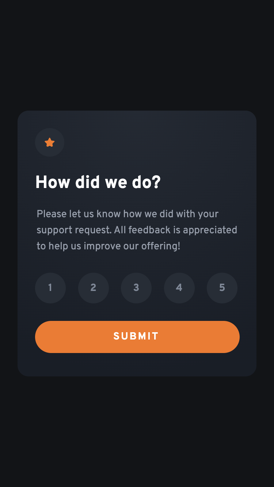
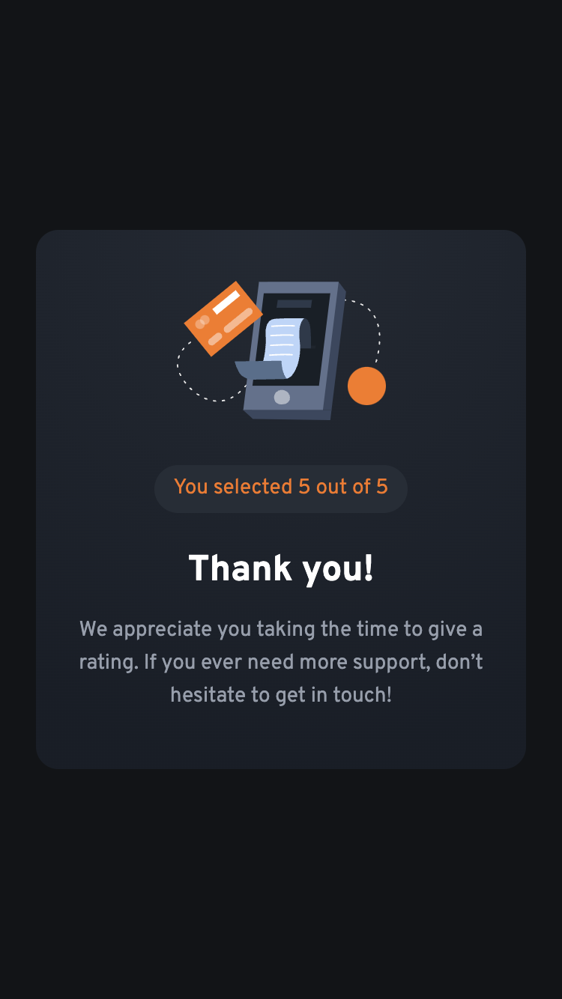
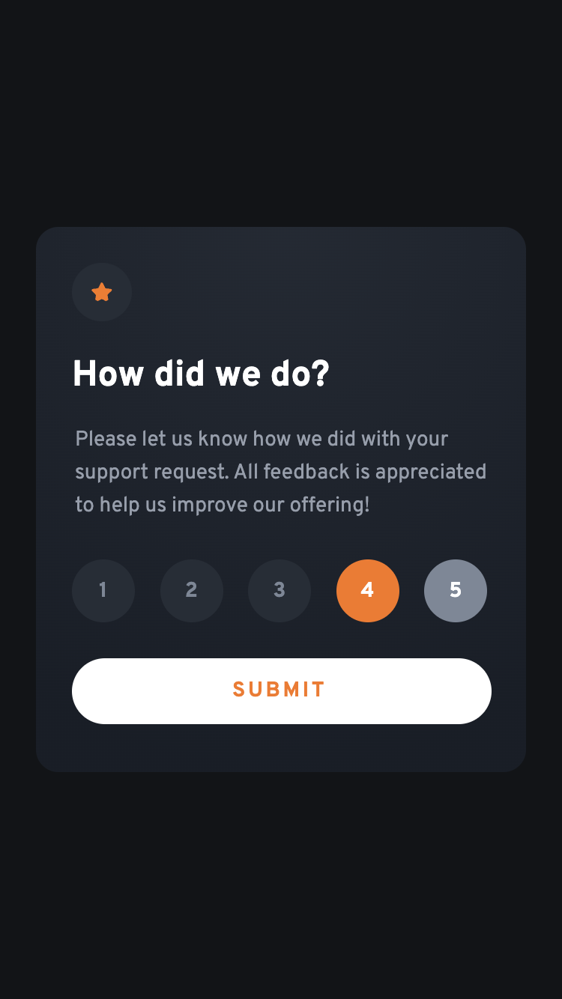
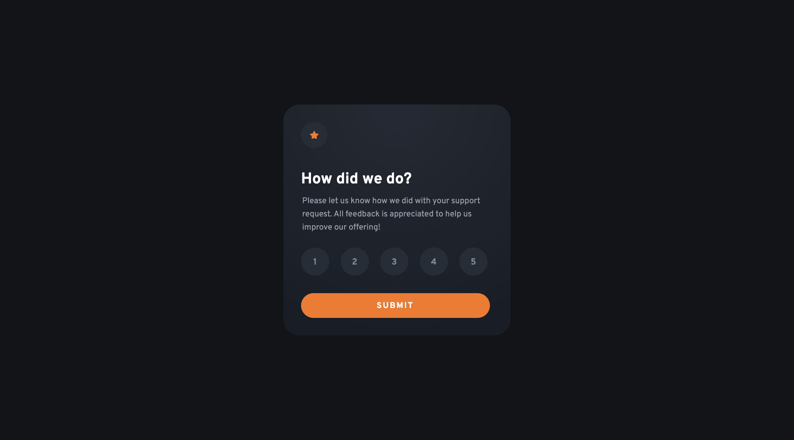
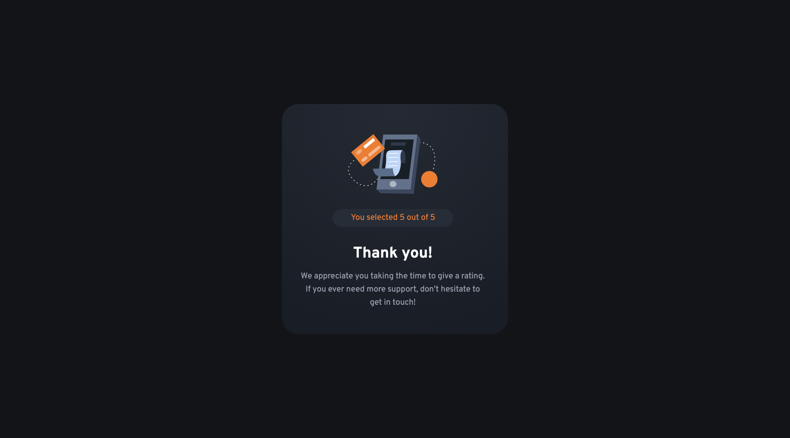

# Frontend Mentor - Interactive rating component solution

This is a solution to the [Interactive rating component challenge on Frontend Mentor](https://www.frontendmentor.io/challenges/interactive-rating-component-koxpeBUmI). Frontend Mentor challenges help you improve your coding skills by building realistic projects.

## Table of contents

- [Overview](#overview)
  - [The challenge](#the-challenge)
  - [Screenshot](#screenshot)
  - [Links](#links)
- [My process](#my-process)
  - [Built with](#built-with)
- [Author](#author)
- [Acknowledgments](#acknowledgments)
## Overview

### The challenge

Users should be able to:

- View the optimal layout for the app depending on their device's screen size
- See hover states for all interactive elements on the page
- Select and submit a number rating
- See the "Thank you" card state after submitting a rating

### Screenshot

### Links

- Solution URL: [Github](https://github.com/tarasis/tarasis.github.io/tree/main/projects/FrontendMentor/newbie/interactive-rating-component)
- Live Site URL: [tarasis.github.io](https://tarasis.github.io/FrontendMentor/newbie/interactive-rating-component/)

## My process

### Built with

- Semantic HTML5 markup
- CSS custom properties
- CSS Grid
- Mobile-first workflow

## Author

- Website - [Robert McGovern](https://www.your-site.com)
- Frontend Mentor - [@tarasis](https://www.frontendmentor.io/profile/tarasis)
- Twitter - [@tarasis](https://www.twitter.com/tarasis)

