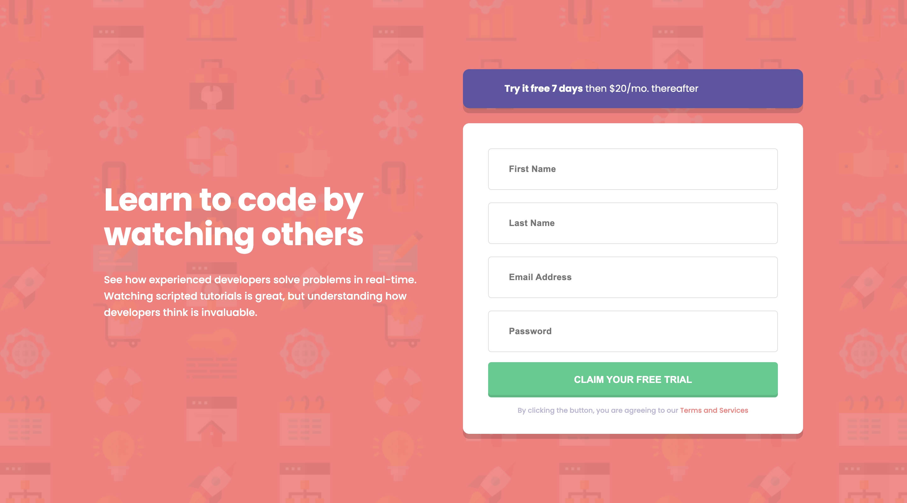
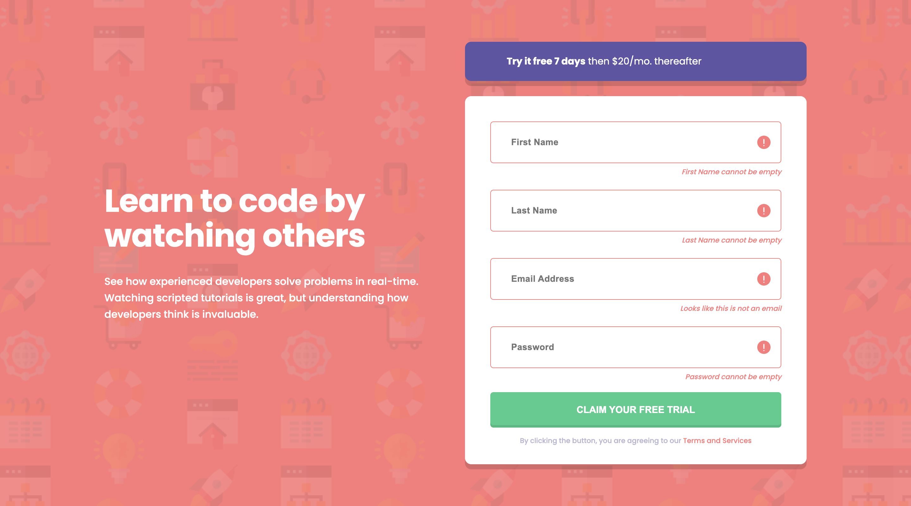

# Frontend Mentor - Intro component with sign up form solution

This is a solution to the [Intro component with sign up form challenge on Frontend Mentor](https://www.frontendmentor.io/challenges/intro-component-with-signup-form-5cf91bd49edda32581d28fd1). Frontend Mentor challenges help you improve your coding skills by building realistic projects.

## Table of contents

- [Frontend Mentor - Intro component with sign up form solution](#frontend-mentor---intro-component-with-sign-up-form-solution)
  - [Table of contents](#table-of-contents)
  - [Overview](#overview)
    - [The challenge](#the-challenge)
    - [Screenshot](#screenshot)
    - [Links](#links)
  - [My process](#my-process)
    - [Built with](#built-with)
    - [What I learned](#what-i-learned)
    - [Continued development](#continued-development)
  - [Author](#author)
  - [Acknowledgments](#acknowledgments)

**Note: Delete this note and update the table of contents based on what sections you keep.**

## Overview

### The challenge

Users should be able to:

- View the optimal layout for the site depending on their device's screen size
- See hover states for all interactive elements on the page
- Receive an error message when the `form` is submitted if:
  - Any `input` field is empty. The message for this error should say *"[Field Name] cannot be empty"*
  - The email address is not formatted correctly (i.e. a correct email address should have this structure: `name@host.tld`). The message for this error should say *"Looks like this is not an email"*

### Screenshot

These screenshots represent the Mobile and Destktop versions, with and without the error states.

### Links

- Solution URL: [Github](https://github.com/tarasis/tarasis.github.io/tree/main/projects/FrontendMentor/newbie/intro-component-with-signup-form)
- Live Site URL: [Tarasis @ Github.io](https://tarasis.github.io/FrontendMentor/newbie/intro-component-with-signup-form/)

## My process

As usual I started with a mobile first approach, aiming to put most things into CSS properties, so that for the desktop version I was mostly just updating the values of the properties.

I'm not sure why I decided to not use a lot of classes, and instead put styling directly onto the html elements. I think it was just to be a little different than normal. I know that in a real project that I wouldn't use this approach.

For the JavaScript I tried to minimise how much I was doing there, and looked to leverage combining text with an element id so I could unhide or hide the error message.

### Built with

- Semantic HTML5 markup
- CSS custom properties
- Flexbox
- Mobile-first workflow

### What I learned

Main thing I learnt was that the `checkValidity()` method triggers checks for ALL HTML inputs on the page, not just the specific one you targeted. This surprised me, and was consistent across Safari, Firefox and Chrome.

### Continued development

Continue working through challenges. I really must put some time into learning BEM / the version that Kevin Powell uses.

## Author

- Website - [Robert McGovern](https://tarasis.net)
- Frontend Mentor - [@tarasis](https://www.frontendmentor.io/profile/tarasis)
- Twitter - [@tarasis](https://www.twitter.com/tarasis)

## Acknowledgments

Matt for this useful service.