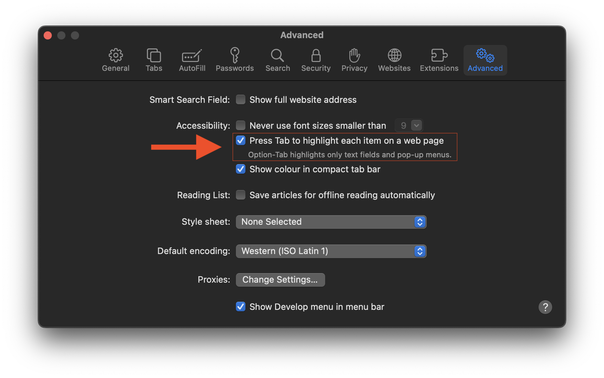

# Frontend Mentor - Meet landing page solution

This is a solution to the [Meet landing page challenge on Frontend Mentor](https://www.frontendmentor.io/challenges/meet-landing-page-rbTDS6OUR). Frontend Mentor challenges help you improve your coding skills by building realistic projects.

## Table of contents

- [Overview](#overview)
  - [The challenge](#the-challenge)
  - [Screenshot](#screenshot)
  - [Links](#links)
- [My process](#my-process)
  - [Built with](#built-with)
  - [What I learned](#what-i-learned)
  - [Useful resources](#useful-resources)
- [Author](#author)

## Overview

### The challenge

Users should be able to:

- View the optimal layout depending on their device's screen size
- See hover states for interactive elements

### Screenshot

Screenshots of the page showing the desktop, tablet and mobile versions of the page.

### Links

- Solution URL: [Github](https://github.com/tarasis/tarasis.github.io/tree/main/projects/FrontendMentor/newbie/meet-landing-page)
- Live Site URL: [tarasis.github.io](https://tarasis.github.io/FrontendMentor/newbie/meet-landing-page/)

## My process

### Built with

- Semantic HTML5 markup
- CSS custom properties
- Flexbox
- Mobile-first workflow

### What I learned

The main thing I learnt is that neither Firefox or Safari support tabbing in an HTML page by default on a Mac. For Safari you have to open `Settings`, go to the `Advanced` tab and check `Press Tab to highlight each item on a web page`

Firefox on a Mac requires manually adding a preference. But I haven't gone through with adding it given the warnings on the page. I'm content with being able to test on Chrome / Polypane and Safari.

[Article Mac Browser Keyboard Navigation](https://www.a11yproject.com/posts/macos-browser-keyboard-navigation/)

### Useful resources

[Article Mac Browser Keyboard Navigation](https://www.a11yproject.com/posts/macos-browser-keyboard-navigation/) - for setting up Safari for tab. Note I did not need to enable `Keyboard Navigation` in macOS 13's System Settings.

- [Stackoverflow answer "How to Allow Keyboard focus of links in Firefox"](https://stackoverflow.com/questions/11704828/how-to-allow-keyboard-focus-of-links-in-firefox/11713537#11713537) - This led me to finding out what to do.

## Author

- Website - [tarasis.net](https://tarasis.net)
- Frontend Mentor - [@tarasis](https://www.frontendmentor.io/profile/tarasis)
- Twitter - [@tarasis](https://www.twitter.com/tarasis)

