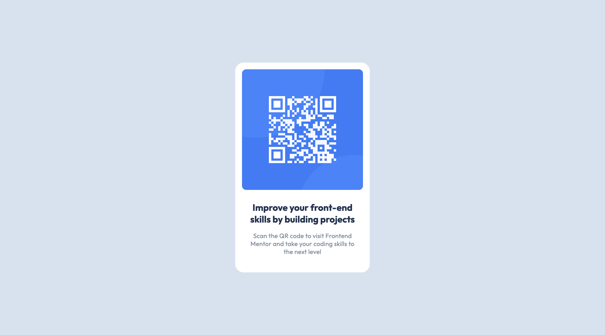

# Frontend Mentor - QR code component solution

This is a solution to the [QR code component challenge on Frontend Mentor](https://www.frontendmentor.io/challenges/qr-code-component-iux_sIO_H). Frontend Mentor challenges help you improve your coding skills by building realistic projects.

## Table of contents

- [Frontend Mentor - QR code component solution](#frontend-mentor---qr-code-component-solution)
  - [Table of contents](#table-of-contents)
  - [Overview](#overview)
    - [Screenshot](#screenshot)
    - [Links](#links)
  - [My process](#my-process)
    - [Built with](#built-with)
    - [What I learned](#what-i-learned)
    - [Continued development](#continued-development)
  - [Author](#author)

## Overview

### Screenshot

### Links

- Solution URL: [Github](https://github.com/tarasis/tarasis.github.io/tree/main/projects/FrontendMentor/newbie/qr-code-component)
- Live Site URL: [Github.io](https://tarasis.github.io/FrontendMentor/newbie/qr-code-component/)

## My process

Quickly laid out the properties based on the design.
Added markup structure to html, and moved text into position.
Tested

### Built with

- Semantic HTML5 markup
- CSS custom properties
- Flexbox
- Mobile-first workflow

### What I learned

Nothing, more an exercise to practice speed and accuracy, and to gain confidence and trust myself.

### Continued development

I need to really site down with Aria and a11y docs.

## Author

- Website - [Robert McGovern - blog](https://tarasis.net)
- Frontend Mentor - [@tarasis](https://www.frontendmentor.io/profile/tarasis)
- Twitter - [@tarasis](https://www.twitter.com/tarasis)