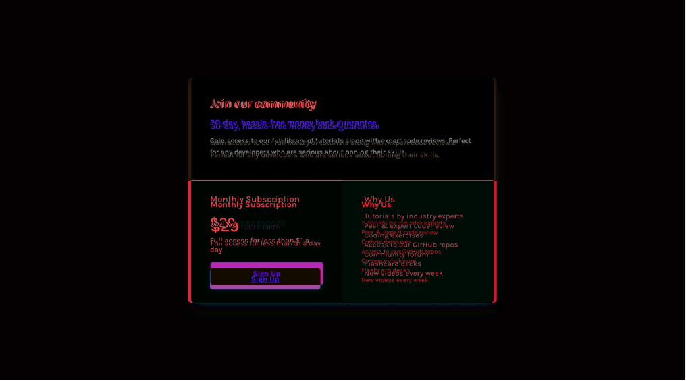

Next challenge started 12th Sept 2020

As usual copy files into place and commit.  
Checked size of the design images: 1440x800 and 375x870  

Set up the style.css to have the base things listed in the style guide (font, colors, font size), and add style.css to index.html

Looking at the designs, I see it as Flex, with 2 rows in a column. On the desktop, the 2nd row, is a row of 2 items, on mobile the 2nd row becomes as column of 2 items.  
Otherwise there doesn't seem to be any obvious/glaring differences between the 2 designs. Sizing seems largely the same, as does positioning of everything inside their respective boxes.

Set-up the HTML into `div`s to match what I think are the distinct sections. Absolutely need to change some of the names, but I can't think of better descriptors at the moment. (seriously ... "sellBlurb" 🙄)

Aside: Would love something to take all the classes I define in the html file and put them into the css file ... *quick google later* Oooooh. Such a thing does exist https://marketplace.visualstudio.com/items?itemName=diz.ecsstractor-port ... lets see how well that works.  
Seems to ... Nice!

**Just noticed, the corners on the mobile design column are less rounded than on the desktop design. Need to properly compare, might just be a sizing thing.** Check!

Continued basic styling. Used a color picker to find (roughly) what the other tourqise/aquamarine color was.

Stopped for lunch & roleplaying.

... cue next day ....

read a little.  
Question struck me, is it better to use `margin-top` or `bottom` when it comes to layout between elements. Lead me to this article which says `margin-top` https://matthewjamestaylor.com/css-margin-top-vs-bottom useful article but basically **"Always use top margin. The reason is related to the 'C' in CSS"**. Also in article **"Set default styles for webpage modules then override rules depending on proceeding context."** which seems logical to me and is what I'm trying to do. Set basic css first, See cominalities between the mobile and desktop designs. Then do mobile. Then make last adjustments for desktop.

2020-09-23
Many Days off - no drive, energy, or anything.  
Went to start today but ended up phaffing with other things (like not finding the right VSCode theme to use, or the right Fish theme, or or or or or)  

As it stands my attempt is roughly there. Desktop just needs some nudging for alignments to be good. Need to figure out the shadow used. The mobile version is a bit further away. Mine is probably 200 pixels taller.

Which is **hilarious** considering I started with mobile first and haven't done any tweaking for desktop yet!

Finding my solution is quite fragile. Tweaking bits of padding causes shifts elsewhere that I don't want. So adjusting one thing requires tweaking another.
**Not Ideal**

Have checked it in. Heart isn't in working through this one. I __know__ I could tweak this and get it there. Its not far as the diffs show.  

## Mobile Difference

## Desktop Difference

