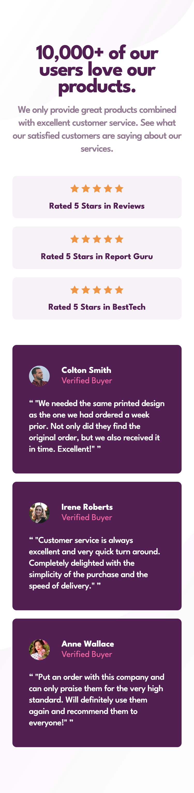
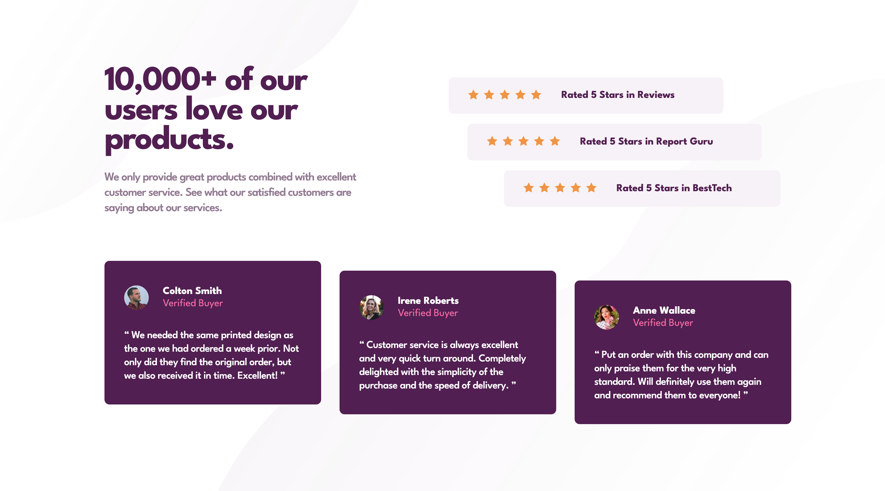

# Frontend Mentor - Social proof section solution

This is a solution to the [Social proof section challenge on Frontend Mentor](https://www.frontendmentor.io/challenges/social-proof-section-6e0qTv_bA). Frontend Mentor challenges help you improve your coding skills by building realistic projects.

## Table of contents

- [Frontend Mentor - Social proof section solution](#frontend-mentor---social-proof-section-solution)
  - [Table of contents](#table-of-contents)
  - [Overview](#overview)
    - [The challenge](#the-challenge)
    - [Screenshot](#screenshot)
    - [Links](#links)
  - [My process](#my-process)
    - [Built with](#built-with)
    - [What I learned](#what-i-learned)
    - [Continued development](#continued-development)
  - [Author](#author)

## Overview

### The challenge

Users should be able to:

- View the optimal layout for the section depending on their device's screen size

### Screenshot

### Links

- Solution URL: [Tarasis on Github](https://github.com/tarasis/tarasis.github.io/tree/main/projects/FrontendMentor/newbie/social-proof-section)
- Live Site URL: [tarasis.github.io](https://tarasis.github.io/FrontendMentor/newbie/social-proof-section)

## My process

As usual, I started Mobile first. I setup CSS properties for colors, typography and such. After a bit I realised that the font needed was different from when I originally downloaded the starter kit for this challenge. Which meant that my variables were off.

Once I'd finished the mobile version, I re-arranged the HTML slightly because I forgot to make a top and bottom section.

I had little problem with the alignments for the ratings and reviews, but I did end up waisting an hour chasing desktop alignment with design image. I just couldn't quite nail it.

I also played a bit with where the desktop version should start.

### Built with

- Semantic HTML5 markup
- CSS custom properties
- Flexbox
- CSS Grid (only for positioning in the middle of the page )
- Mobile-first workflow

### What I learned

To check for updated files.

Don't chase perfection.
### Continued development

Practice practice and practice.

## Author

- Website - [Robert McGovern blog](https://tarasis.net)
- Frontend Mentor - [@tarasis](https://www.frontendmentor.io/profile/tarasis)
- Twitter - [@tarasis](https://www.twitter.com/tarasis)

