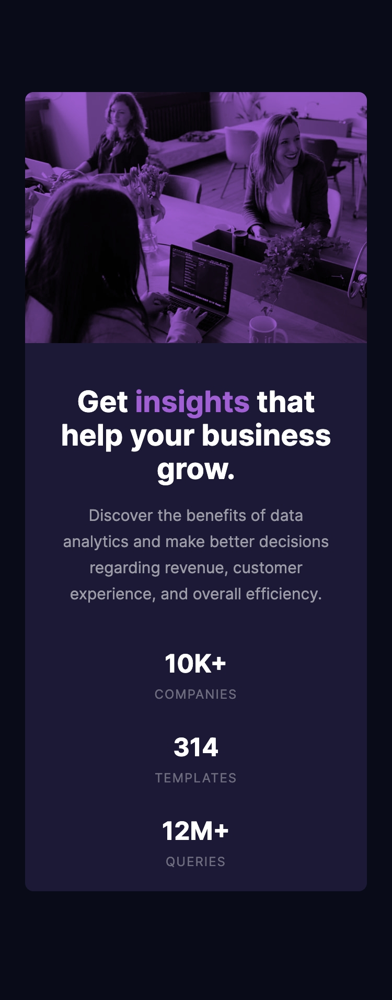

# Frontend Mentor - Stats preview card component solution

This is a solution to the [Stats preview card component challenge on Frontend Mentor](https://www.frontendmentor.io/challenges/stats-preview-card-component-8JqbgoU62). Frontend Mentor challenges help you improve your coding skills by building realistic projects. 

## Table of contents

- [Overview](#overview)
  - [The challenge](#the-challenge)
  - [Screenshot](#screenshot)
  - [Links](#links)
- [My process](#my-process)
  - [Built with](#built-with)
  - [What I learned](#what-i-learned)
  - [Continued development](#continued-development)
  - [Useful resources](#useful-resources)
- [Author](#author)
- [Acknowledgments](#acknowledgments)

**Note: Delete this note and update the table of contents based on what sections you keep.**

## Overview

### The challenge

Users should be able to:

- View the optimal layout depending on their device's screen size

### Screenshot

Two screenshots, the first is the Desktop solution, then the mobile solution. The mobile is the closest, I decided not to chase doing getting the Desktop one spot on.

### Links

- Solution URL: [Solution on GitHub](https://github.com/tarasis/tarasis.github.io/tree/main/FrontendMentor/newbie/stats-preview-card-component)
- Live Site URL: [Live Site](https://tarasis.github.io/FrontendMentor/newbie/stats-preview-card-component/index.html)

## My process

This was a little tricky just from the point of view that I hadn't done any HTML/CSS dev / study in 9 months. So it was a case of trying to remind myself of various options that I could do.

### Built with

- Semantic HTML5 markup
- CSS custom properties
- Flexbox

### What I learned

The main thing was to just let my solution go. In previous ones I would iterate lots to make it as close as I felt I could make it.

As I did most of this one a couple of weeks ago and forgot to take notes I can't really comment on anything else I learnt.

## Author

- Website - [Tarasis.net](https://tarasis.net)
- Frontend Mentor - [@tarasis](https://www.frontendmentor.io/profile/tarasis)
- Twitter - [@tarasis](https://www.twitter.com/tarasis)

## Acknowledgments

Matt at Frontend Mentor for coming up with the idea of challenges like this.