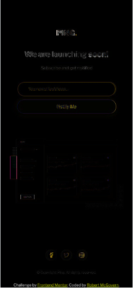

6th Sept 2020

Next project, decided to go for something slightly different with a little JavaScript required.
Added basic files for css and javascript, including a .jshintrc file

```
{
    "esversion": 6,
    "browser": true,
    "strict": "global"
}
```

Set up basic styling into the CSS from the style doc. Add colors, font + sizes.

Add font awesome to index.html + setup attribution

Add basic tags to index.html for header/main/footer, then in main splitting into 3, text headings, form and dashboard illustration.

__Q should the copyright be added to the footer or the bottom of the main????__

Started mostly with mobile

spent the morning struggling to get flex to work the way I wanted. Got there but also realised that I didn't need to use it the way I did. *facepalm*

Continue to play with positioning rather than focusing on main styling

Nudge screenshot nudge screenshot nudge screenshot *sigh*
I'm not OCD I swear ...

Realised better to social icons into footer and move the footer out of the flex container, and clamp it to the bottom.

So mobile is virtually there. The Ping! logo is slightly off, as is the "We are launching soon!"
So close *sigh*

Day break

Spent 20 minutes playing with mobile positioning. Crazy I know, but its like __near__ spot on.



Worked on the desktop matching. Went much quicker, and getting faster at eyeballing sizes/size differences
Was easier working on mobile first, and then adjusted for desktop on this one.


Now to remove extra adjustments that aren't needed (because they are duplicates of further up the page.)

Final steps:
Add JS error checking on submit button (valid email address, and error on submit on an empty field (although my preference really is disable the button if nothing is in the field))
    An error will trigger a text line to appear in red
    And change the border color of the input email field to red.
Hover States for Social Buttons (flip colors)

Attempted to use hover state to change the background of the fa-stack but it wasn't triggering. Could only change the color of the item at the top of the stack (i.e the social icon)
Learnt you can change css of other elemnts when hovering over a different one ... sorta. Has to be a child you are changing, https://stackoverflow.com/questions/19121223/css-change-an-element-content-on-hover-from-different-element

Next Day:

Realised I had to change a few things. Change the input field from `type="email"` to `type="text"` so that I can do the field validation.

Added a div that starts as hidden and has no text

Added some css styling for the text color, and added an error class for changing the input fields border

In JavaScript created a couple of functions, the first that has to return true/false when the user presses "Notify Me" (basically onsubmit event), does some validation of address length, and address structure.

The other method reveals the hidden div and sets the input fields border to red.

There is a third method that I couldn't decide about using. It will clear the error message. The idea being that as soon as the user starts typing again in the field that the error is cleared. (or better yet, when the field gets focus again. I can check for that? )

Created a simplistic regex for email address validation, with some test cases to check my logic. I'm still learning regex, and I don't want to spend the time learning all the combinations for email addresses.

I did research and find a more "correct" regex that I could use, but I will stick with my for this sample.

Played with alignment so mobile & mobile error are close.


Swapped method of doing the circles around the social icons. I would have preferred the stacks but I couldn't figure out how to put a thin border around a fa-circle

BUGS:
* ~~when screen not tall enough social buttons and copyright pushed up the page because I clamped them to the bottom of the browser window, rather than the page.~~
* ~~because I used attacked circles I can't just change the background to blue for hover. Need to either sub in a filled circle on hover OR swap to manually creating the circle~~
* ~~transitions sizes between 600 and about 800 look wrong / bad / odd~~ (improved but thats it)

The transition thing is really bad


How to better handle this?????? Should be dynamic font sizing & padding I guess?
I have a working solution the error message on the 1440x1024 resolution but it doesn't look good/work on the in between resolutions. Positioning should be calculated, based on resolution

To Research: 
* Dynamic font sizing to look nicer transitioning up.

Found a formula to scale the fonts, tried to use it to work with the view port width scaling but it wouldn't work. 

Fixed positioning of the footer section and social buttons. Needed it back in the flexbox, and set the margin-top to auto to fill up the space

Last thing is my hack for the error when email field and button are in a row. How to position the text relative to the input field? Can I hide it behind it and move it down? If its in the same row, then it takes up space which we don't want, hence the 0 width (zero height for when in column)

Ergh. Want to be done with this. Frustrating myself.

MY GAWD. Eureka, just realised that what I want to use is Flexbox ordering. By doing this, the error message is first, and all I need to do is shift it downwards, no horizontal translation needed. PERFECT.