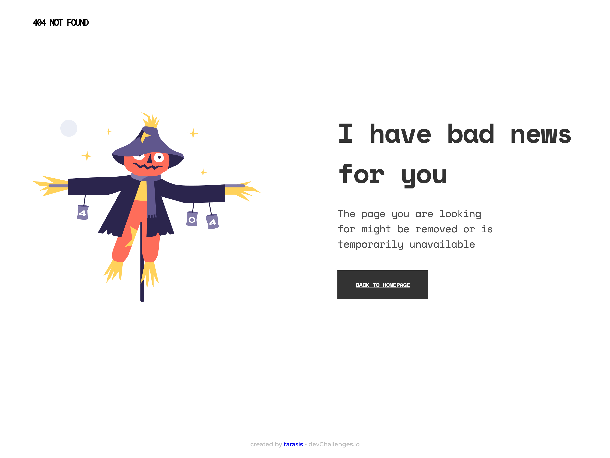

<!-- Please update value in the {}  -->

<h1 align="center">Challenge 1: 404 Not Found</h1>

   Solution for a challenge from  <a href="http://devchallenges.io" target="_blank">Devchallenges.io</a>.

  <h3>
    <a href="https://tarasis.github.io/devchallenges/404-not-found/">
      Demo
    </a>
     | 
    <a href="https://github.com/tarasis/tarasis.github.io/tree/main/projects/devchallenges/404-not-found/">
      Solution
    </a>
     | 
    <a href="https://devchallenges.io/challenges/wBunSb7FPrIepJZAg0sY">
      Challenge
    </a>
  </h3>

<!-- TABLE OF CONTENTS -->

## Table of Contents

- [Table of Contents](#table-of-contents)
- [Overview](#overview)
  - [Built With](#built-with)
- [Acknowledgements](#acknowledgements)
- [Contact](#contact)

<!-- OVERVIEW -->

## Overview

Fairly responsive build of this error page. Most font sizes and line heights have been scaled using the [responsive font calculator](https://websemantics.uk/tools/responsive-font-calculator/).

At 800px `min-width` a number of CSS properties are updating for the larger screen layout.

Took a different approach than normal with splitting CSS between font settings and then positional settings. Honestly I find the approach both easier but also increased cognitive load a little. As I'm needing to think about where things are.

I should have used more classes rather than class + html attribute (i.e. `.text-container p`)

### Built With

Pure HTML & CSS, although making heavy use of CSS Properties and dynamic sizing.

## Acknowledgements

- [Fluid-responsive font-size calculator](https://websemantics.uk/tools/responsive-font-calculator/) by Mike Foskett for building this useful calculator.

## Contact

- Website - Blog [tarasis.net](https://tarasis.net)
- Website - Portfolio [rmcg.dev](https://rmcg.dev)
- GitHub [@tarasis](https://github.com/tarasis)
- Twitter [@tarasis](https://twitter.com/tarasis)
