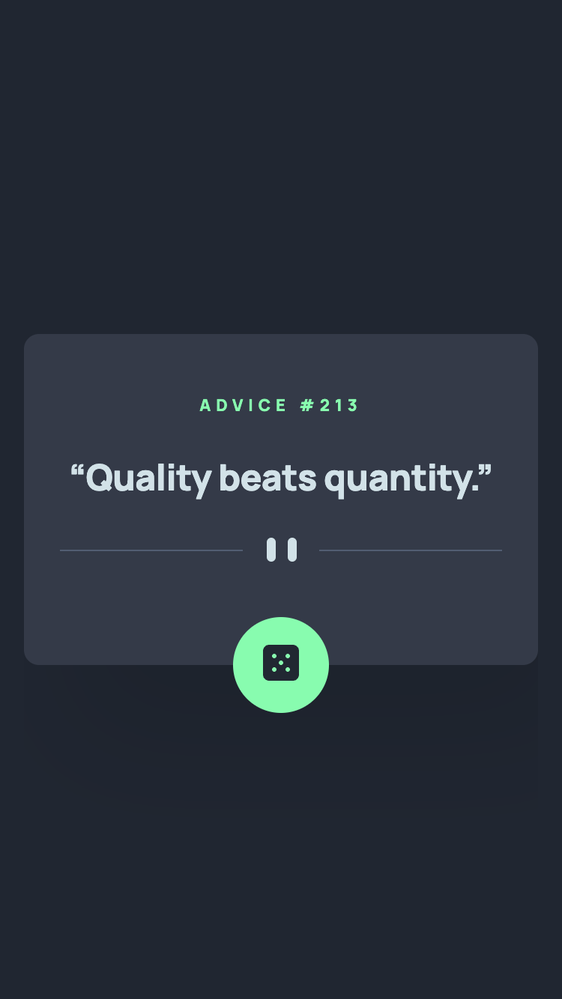
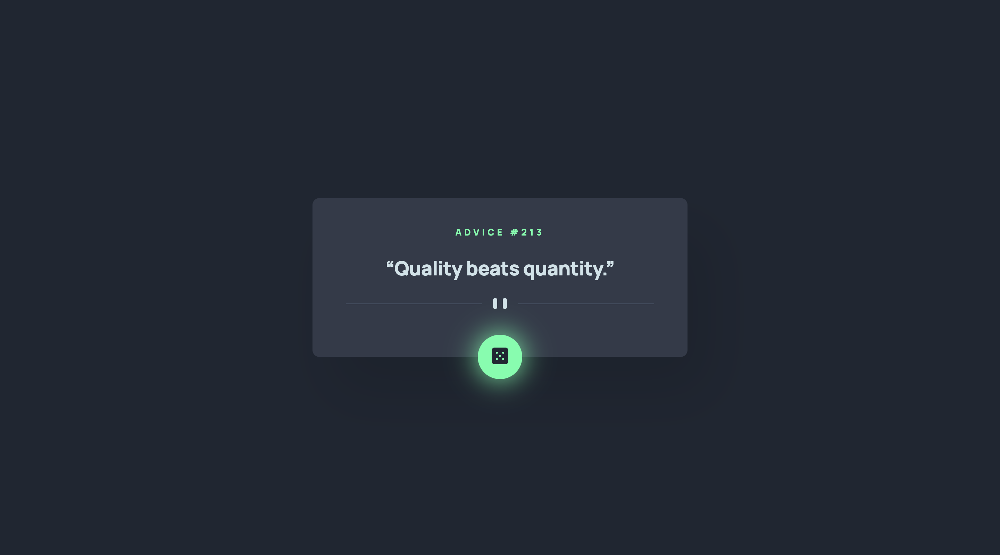

# Frontend Mentor - Advice generator app solution

This is a solution to the [Advice generator app challenge on Frontend Mentor](https://www.frontendmentor.io/challenges/advice-generator-app-QdUG-13db). Frontend Mentor challenges help you improve your coding skills by building realistic projects.

## Table of contents

- [Frontend Mentor - Advice generator app solution](#frontend-mentor---advice-generator-app-solution)
  - [Table of contents](#table-of-contents)
  - [Overview](#overview)
    - [The challenge](#the-challenge)
    - [Screenshot](#screenshot)
    - [Links](#links)
  - [My process](#my-process)
    - [Built with](#built-with)
    - [What I learned](#what-i-learned)
  - [Author](#author)
  - [Acknowledgments](#acknowledgments)

## Overview

### The challenge

Users should be able to:

- View the optimal layout for the app depending on their device's screen size
- See hover states for all interactive elements on the page
- Generate a new piece of advice by clicking the dice icon

### Screenshot

### Links

- Solution URL: [Add solution URL here](https://github.com/tarasis/tarasis.github.io/tree/main/projects/FrontendMentor/junior/advice-generator-app/))
- Live Site URL: [Add live site URL here](https://tarasis.github.io/FrontendMentor/junior/advice-generator-app/)

## My process

I styled up mobile first, then desktop, added the JavaScript for retrieving the data and then added the animation, making sure to support prefers reduced motion.

### Built with

- Semantic HTML5 markup
- CSS custom properties
- Flexbox (only for centering for button)
- CSS Grid (only for centering)
- Mobile-first workflow

### What I learned

Remind myself how await/async works in JavaScript as its been many months since I used it.

## Author

- Website - [Robert McGovern - blog](https://tarasis.net)
- Frontend Mentor - [@tarasis](https://www.frontendmentor.io/profile/tarasis)
- Twitter - [@tarasis](https://www.twitter.com/tarasis)

## Acknowledgments

Matt @ Frontend Mentor for creating the site.