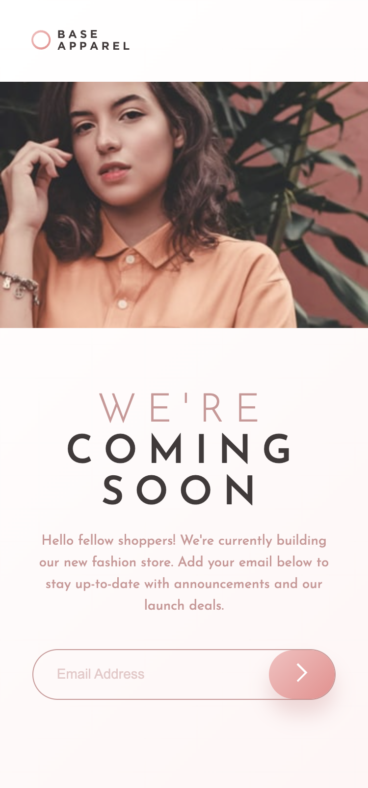

# Frontend Mentor - Base Apparel coming soon page solution

This is a solution to the [Base Apparel coming soon page challenge on Frontend Mentor](https://www.frontendmentor.io/challenges/base-apparel-coming-soon-page-5d46b47f8db8a7063f9331a0). Frontend Mentor challenges help you improve your coding skills by building realistic projects.

## Table of contents

- [Overview](#overview)
  - [The challenge](#the-challenge)
  - [Screenshot](#screenshot)
  - [Links](#links)
- [My process](#my-process)
  - [Built with](#built-with)
  - [What I learned](#what-i-learned)
  - [Continued development](#continued-development)
  - [Useful resources](#useful-resources)
- [Author](#author)
- [Acknowledgments](#acknowledgments)

**Note: Delete this note and update the table of contents based on what sections you keep.**

## Overview

### The challenge

Users should be able to:

- View the optimal layout for the site depending on their device's screen size
- See hover states for all interactive elements on the page
- Receive an error message when the `form` is submitted if:
  - The `input` field is empty
  - The email address is not formatted correctly

### Screenshot

### Links

- Solution URL: [on GitHub](https://github.com/tarasis/tarasis.github.io/tree/main/projects/FrontendMentor/newbie/base-apparel-coming-soon)
- Live Site URL: [on GitHub Pages](http://tarasis.github.io/FrontendMentor/newbie/base-apparel-coming-soon)

## My process

### Built with

- Semantic HTML5 markup
- CSS custom properties
- Flexbox
- CSS Grid
- Mobile-first workflow

### What I learned

The <picture> element is a container only. The  element is the main part describing its contents. <source> only describes different sources. So the alt remains the same for all of them regardless of the source.

https://stackoverflow.com/a/48207973

I learned that I'm not good at handling input fields with a button and an error image.

### Continued development

I want to go through other peoples solutions for how the handled the input and the adjacent button and error image. I'm sure there is a better solution than mine, particularly because mine limits the size of the input field more than it should.

### Useful resources

- [Stackoverflow Visually Hidden answer](https://stackoverflow.com/a/71349645) - I found this useful for doing adding the label but making it visually hidden.

## Author

- Website - [Robert McGovern Blog](https://tarasis.net)
- Frontend Mentor - [@tarasis](https://www.frontendmentor.io/profile/tarasis)
- Twitter - [@tarasis](https://www.twitter.com/tarasis)

## Acknowledgments

My thanks to Julio Cinquina on the FEM Slack for correcting my misunderstanding of the `:has` pseudo-class.