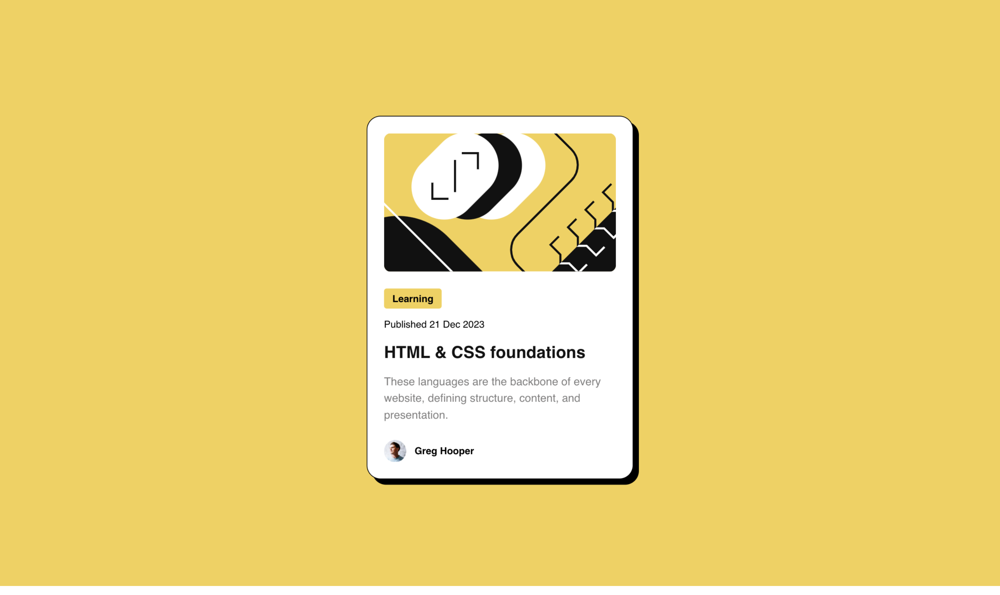

# Frontend Mentor - Blog preview card solution

This is a solution to the [Blog preview card challenge on Frontend Mentor](https://www.frontendmentor.io/challenges/blog-preview-card-ckPaj01IcS). Frontend Mentor challenges help you improve your coding skills by building realistic projects.

## Table of contents

- [Frontend Mentor - Blog preview card solution](#frontend-mentor---blog-preview-card-solution)
	- [Table of contents](#table-of-contents)
	- [Overview](#overview)
		- [The challenge](#the-challenge)
		- [Screenshot](#screenshot)
		- [Links](#links)
	- [My process](#my-process)
		- [Built with](#built-with)
		- [What I learned](#what-i-learned)
		- [Continued development](#continued-development)
		- [Useful resources](#useful-resources)
	- [Author](#author)

## Overview

### The challenge

Users should be able to:

- See hover and focus states for all interactive elements on the page

### Screenshot

Mobile

Desktop

### Links

- Solution URL: [Github](https://github.com/tarasis/tarasis.github.io/tree/main/projects/FrontendMentor/newbie/blog-preview-card)
- Live Site URL: [Tarasis Github.io](https://tarasis.github.io/projects/FrontendMentor/newbie/blog-preview-card)

## My process

### Built with

- Semantic HTML5 markup
- CSS custom properties
- Flexbox
- CSS Grid
- Mobile-first workflow
- Fluid Sizing (so no media queries)
- Nesting & `@layer`

### What I learned

Main thing I learnt is that I find it difficult to split out css across multiple files. I understand the principle but working out what goes where is tricky.

### Continued development

### Useful resources

- [Utopia](https://utopia.fyi/space/calculator) for its wonderful fluid space calculator.
- [Polypane](https://polypane.app/) for making it super easy to see how the build looks at mobile & desktop sizes.

## Author

- Website - [Robert McGovern](https://tarasis.net)
- Frontend Mentor - [@tarasis](https://www.frontendmentor.io/profile/tarasis)
- Twitter/X - [@tarasis](https://www.twitter.com/tarasis)

