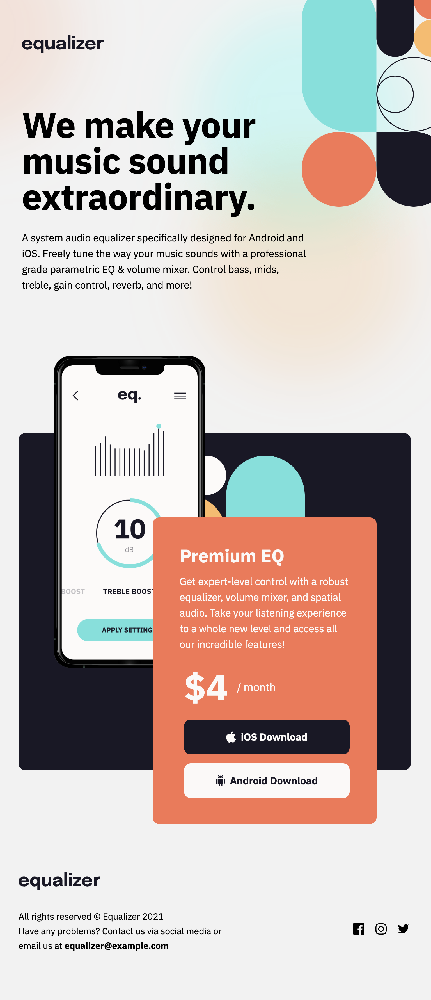
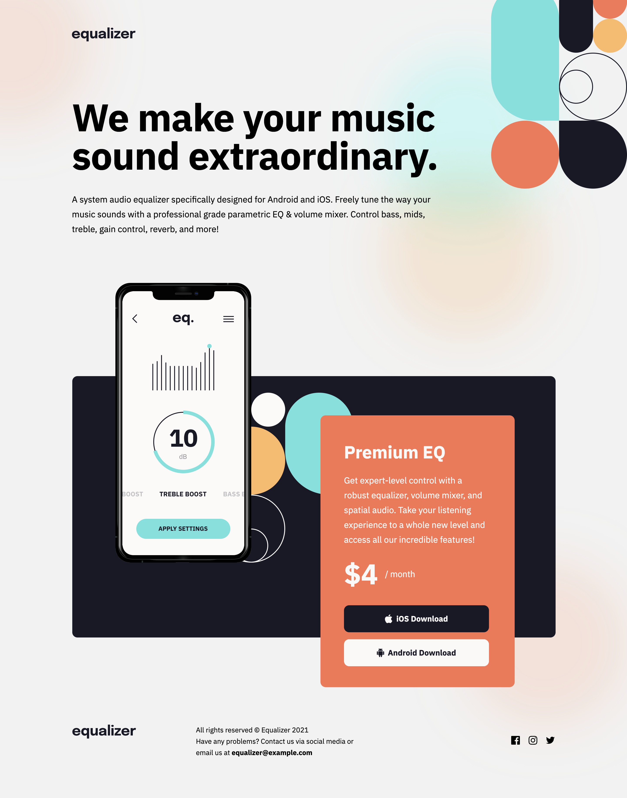

# Frontend Mentor - Equalizer landing page solution

This is a solution to the [Equalizer landing page challenge on Frontend Mentor](https://www.frontendmentor.io/challenges/equalizer-landing-page-7VJ4gp3DE). Frontend Mentor challenges help you improve your coding skills by building realistic projects.

## Table of contents

- [Frontend Mentor - Equalizer landing page solution](#frontend-mentor---equalizer-landing-page-solution)
  - [Table of contents](#table-of-contents)
  - [Overview](#overview)
    - [The challenge](#the-challenge)
    - [Screenshot](#screenshot)
    - [Links](#links)
  - [My process](#my-process)
    - [Built with](#built-with)
    - [What I learned](#what-i-learned)
    - [Continued development](#continued-development)
    - [Useful resources](#useful-resources)
  - [Author](#author)

## Overview

### The challenge

Users should be able to:

- View the optimal layout depending on their device's screen size
- See hover states for interactive elements

### Screenshot

This is completed challenges at the design file sizes.

Despite somewhat pixel chasing towards the end, the comparison video of the build (left side of slider) vs design (right side of slider), I fell a little short.

### Links

- Solution URL: [Github](https://github.com/tarasis/tarasis.github.io/tree/main/projects/FrontendMentor/newbie/equalizer-landing-page)
- Live Site URL: [tarasis.github.io](https://tarasis.github.io/FrontendMentor/newbie/equalizer-landing-page/)

## My process

My first step was to break down the design to establish that there were three sections of content + logo.

After that I built out the properties I thought I would need. Then I build the mobile version. I did some initial fiddling with placement of the blurry background image but left chasing exactness till the end.

At the end just for interest I ran my solution under Lighthouse, and got a favorable report.

### Built with

- Semantic HTML5 markup
- CSS custom properties
- Flexbox
- CSS Grid
- Mobile-first workflow

### What I learned

To only be so beholden to the design. If I was in a position to I would be actively going to the designer to ask why certain padding areas are uneven (for instance the product card, the left/right padding is odd  / unbalanced. Particularly around the price block, where for tablet and mobile its more indented).

After that I built out the tablet, then desktop. Making as few tweaks as possible from one to the next.

At the end I realized that really I had built it to match the design sizes, and not really be responsive in the between sizes. Its okay from Mobile to Tablet, but it leaves a lot to design for Tablet to Desktop and beyond.

It was at this point that I realized I may have tackled the middle section the wrong way around.

For the middle I built out a `Product Card`, the reddish card. Then added the black box and the image of the phone using the `::before` pseudo selector. Because of that "placing" the `Product Card` requires shifting with `margin-left`, which means I can't do `margin: 0 auto` to auto center along the x axis.

If I had built it the other way around, where I made the black area a `Product Area`, then had the phone image, and the red `Product Card` come off the black box, I could then have used `margin: 0 auto` on the black card and had it nicely centered as I moved up from Tablet to Desktop.

Not sure what approach I would take to handle beyond 1600px in terms of clamping the top logo, then right side image and the intro section.

### Continued development

Take another crack at building the product area and consider different approaches for handling large desktop image sizes.

### Useful resources

The [CSS Card Shadow Effects](https://chenhuijing.com/blog/css-card-shadow-effects/#%F0%9F%A6%8A) article was helpful for reminding me how to do a fake background card.

## Author

- Website - [Robert McGovern](https://tarasis.net)
- Frontend Mentor - [@tarasis](https://www.frontendmentor.io/profile/tarasis)
- Twitter - [@tarasis](https://www.twitter.com/tarasis)