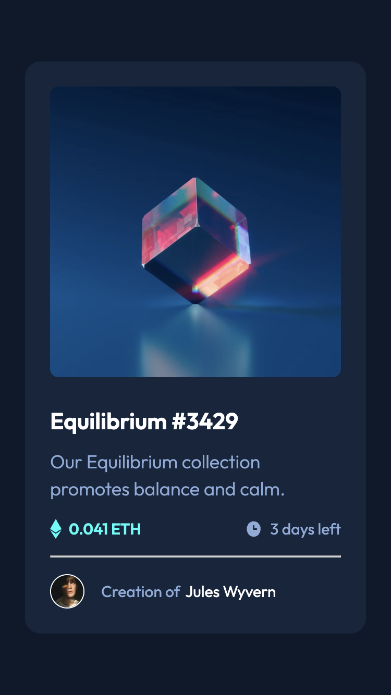
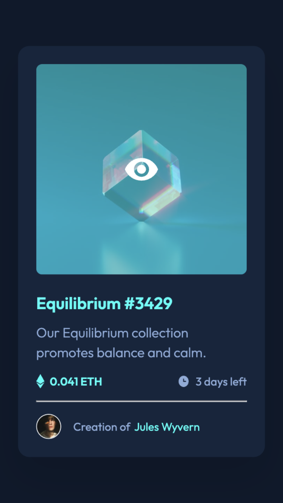
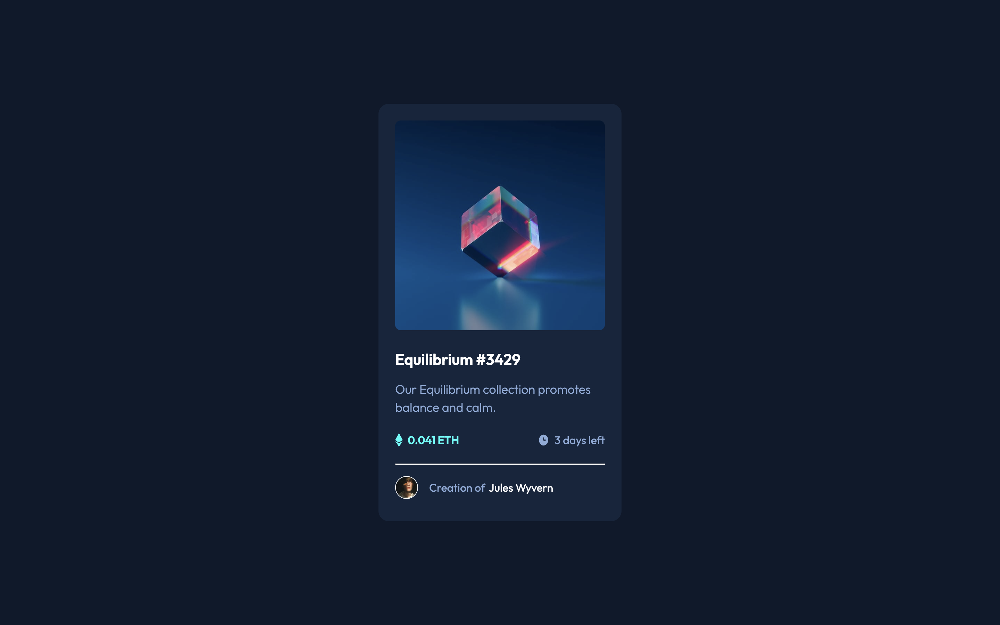

# Frontend Mentor - NFT preview card component solution

This is a solution to the [NFT preview card component challenge on Frontend Mentor](https://www.frontendmentor.io/challenges/nft-preview-card-component-SbdUL_w0U). Frontend Mentor challenges help you improve your coding skills by building realistic projects.

## Table of contents

- [Overview](#overview)
  - [The challenge](#the-challenge)
  - [Screenshot](#screenshot)
  - [Links](#links)
- [My process](#my-process)
  - [Built with](#built-with)
  - [What I learned](#what-i-learned)
- [Author](#author)

**Note: Delete this note and update the table of contents based on what sections you keep.**

## Overview

### The challenge

Users should be able to:

- View the optimal layout depending on their device's screen size
- See hover states for interactive elements

### Screenshot

Screenshots covering the mobile and desktop versions, and one showing the mobile version with active hover states on image, header, and name.

### Links

- Solution URL: [Github](https://github.com/tarasis/tarasis.github.io/tree/main/projects/FrontendMentor/newbie/nft-preview-card-component)
- Live Site URL: [tarasis.github.io](https://tarasis.github.io/FrontendMentor/newbie/nft-preview-card-component/)

## My process

Set up CSS properties as if it could be themed. So in theory you can tweak the properties and the design will respond.

Then I tagged, and built the mobile version first.

For the desktop, I tweaked some of the properties, and then changed margins per design.

The trickiest part I found to do was the hover over the image preview. This I solved by using the `::after` pseudo element, and layering the background color and svg image on top of the preview image.

### Built with

- Semantic HTML5 markup
- CSS custom properties
- Flexbox
- CSS Grid
- Mobile-first workflow

### What I learned

That having an image inside of an `a` tag, means the `a` is 4px larger than expected. According to [this](https://stackoverflow.com/a/3197613) stackoverflow answer it is because "The image is display: inline so it is treated like a character and sits on the baseline. The gap is caused by the space provided for the descender (which you find on letters like j, g, y and p).".

The suggest fix is to set `vertical-align: bottom;` for the `img`. Another option is to set the `img` to `display: block;` however other answers suggest that can break things.

## Author

- Website - [My Blog](https://tarasis.net)
- Frontend Mentor - [@tarasis](https://www.frontendmentor.io/profile/tarasis)
- Twitter - [@tarasis](https://www.twitter.com/tarasis)