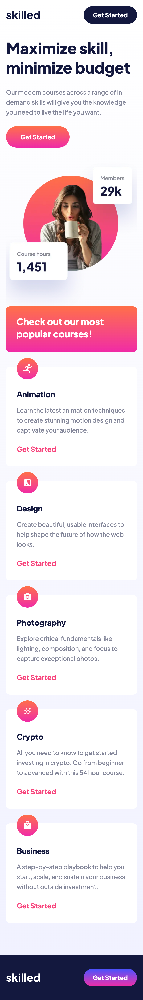
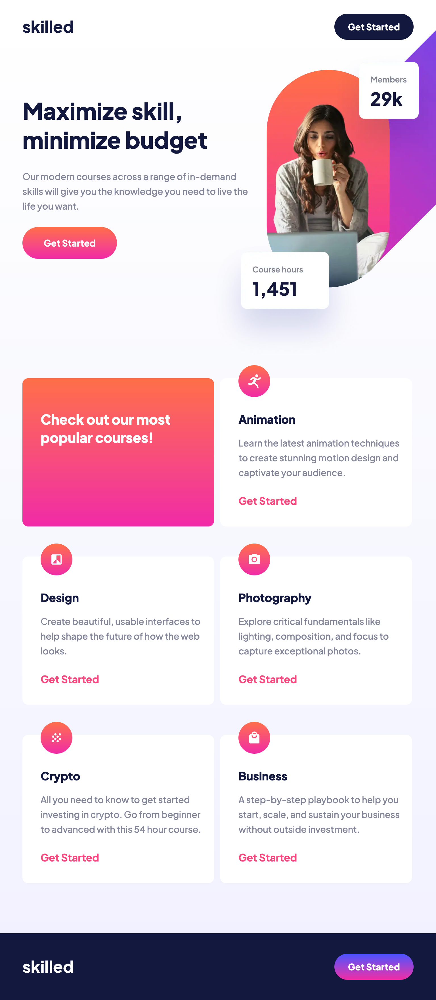
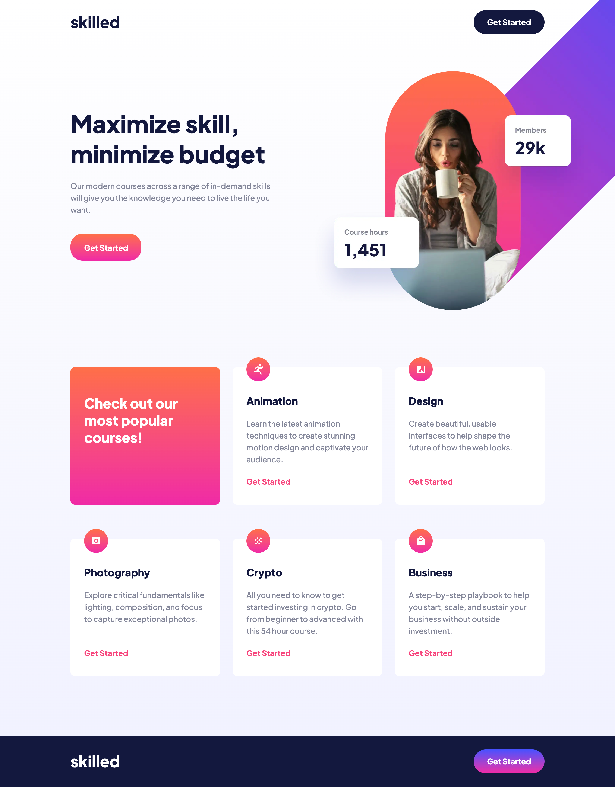

# Frontend Mentor - Skilled e-learning landing page solution

This is a solution to the [Skilled e-learning landing page challenge on Frontend Mentor](https://www.frontendmentor.io/challenges/skilled-elearning-landing-page-S1ObDrZ8q). Frontend Mentor challenges help you improve your coding skills by building realistic projects.

## Table of contents

- [Overview](#overview)
  - [The challenge](#the-challenge)
  - [Screenshot](#screenshot)
  - [Links](#links)
- [My process](#my-process)
  - [Built with](#built-with)
  - [What I learned](#what-i-learned)
  - [Useful resources](#useful-resources)
- [Author](#author)
- [Acknowledgments](#acknowledgments)

**Note: Delete this note and update the table of contents based on what sections you keep.**

## Overview

### The challenge

Users should be able to:

- View the optimal layout depending on their device's screen size
- See hover states for interactive elements

### Screenshot





### Links

- Solution URL: [Github](https://github.com/tarasis/tarasis.github.io/tree/main/projects/FrontendMentor/newbie/skilled-elearning-landing-page)
- Live Site URL: [tarasis.github.io](https://tarasis.github.io/FrontendMentor/newbie/skilled-elearning-landing-page/)

## My process

Built Mobile first, then expanded to Tablet and then Desktop.

At each stage I was checking how my build looked compared to the design in Polypane. (I generated images from Figma) I did try a little to get it close to "pixel perfect", which I do know I shouldn't :) As Grace on Slack would note don't try, and shared this [article](https://www.joshwcomeau.com/css/pixel-perfection/) by Josh Comeau.

I actually finished the build 5 days ago, but wasn't happy with how it handled responsively in the between sides. I stalled and then today realised I could have `margin-inline: auto` for the mobile to tablet size, and then use `justify-content: center` for tablet to desktop. So now it looks "reasonable" between. I did try breaking earlier to the desktop sizings but decided to leave it at 1440px / 90rem.

### Built with

- Semantic HTML5 markup
- CSS custom properties
- Flexbox
- Mobile-first workflow

### What I learned

Really it was mostly using `picture` and `source` tags properly. I tried to use `img srcset` but just couldn't get the following to work as I understood the docs to say.

```

```

### Useful resources

- [Responsive Images MDN](https://developer.mozilla.org/en-US/docs/Learn/HTML/Multimedia_and_embedding/Responsive_images) - Helped with using picture/source/img correctly.
- [Guide to Responsive Images - CSS Tricks](https://css-tricks.com/a-guide-to-the-responsive-images-syntax-in-html/#using-picture)

## Author

- Website - [Robert McGovern Blog](https://tarasis.net)
- Frontend Mentor - [@tarasis](https://www.frontendmentor.io/profile/tarasis)
- Twitter - [@tarasis](https://www.twitter.com/tarasis)
- Mastodon - [@tarasis@social.tarasis.net](https://social.tarasis.net/@tarasis)

## Acknowledgments

Thanks to Grace, Chamu and a-woodworth for trying to answer my Slack question about `srcset`.